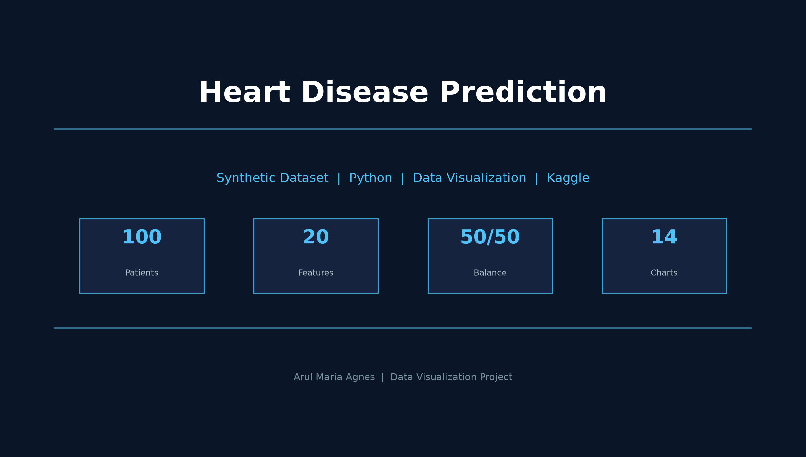
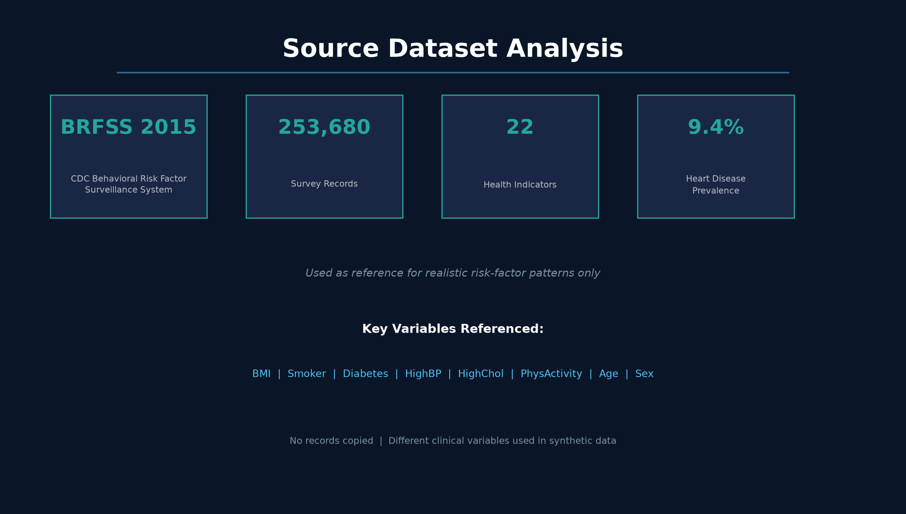
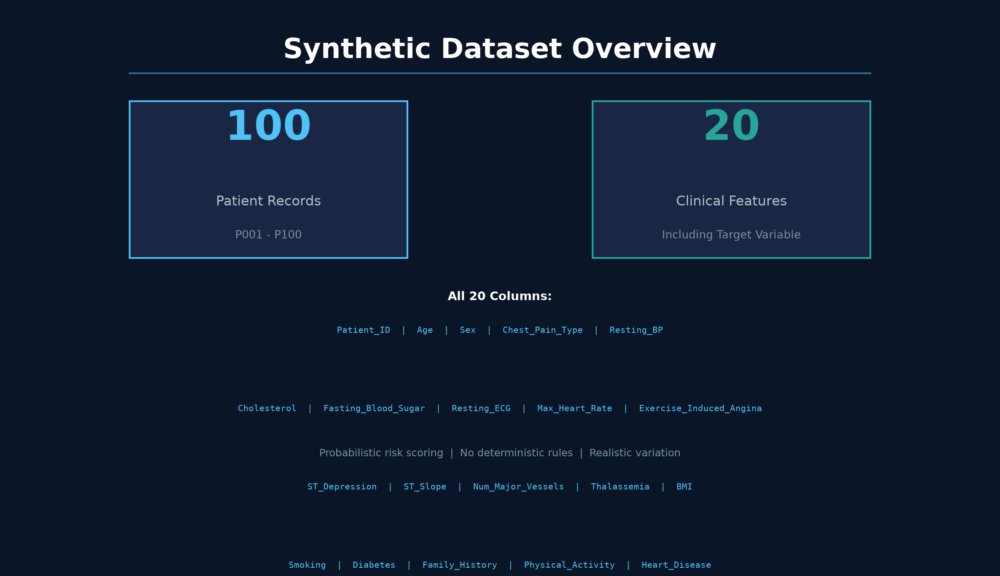
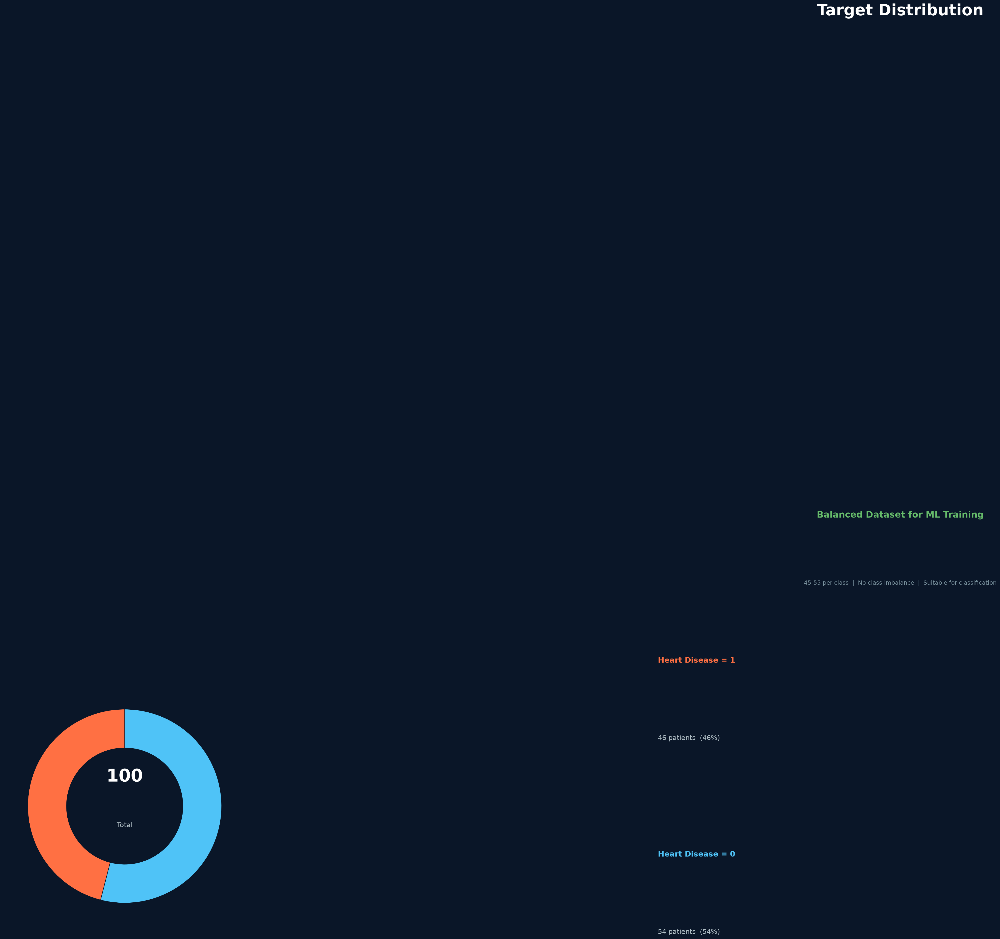
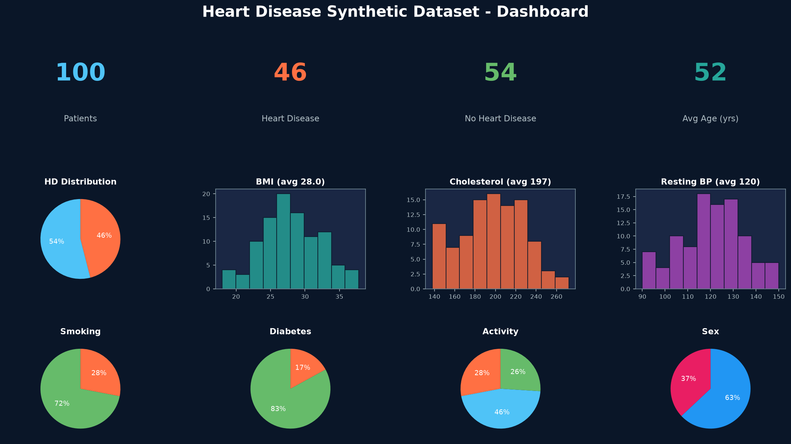
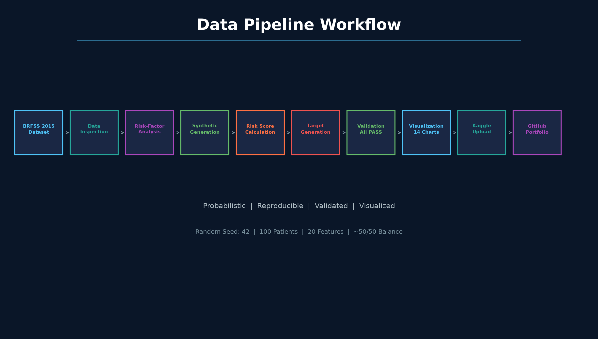
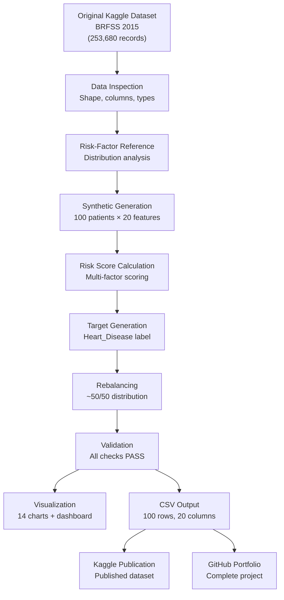
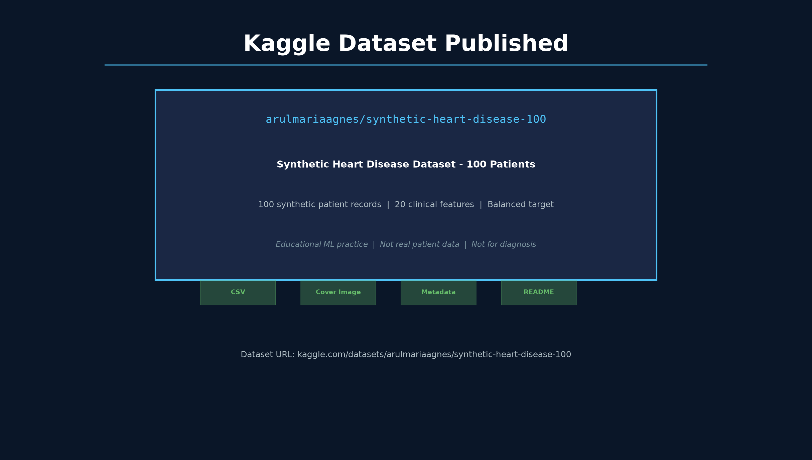
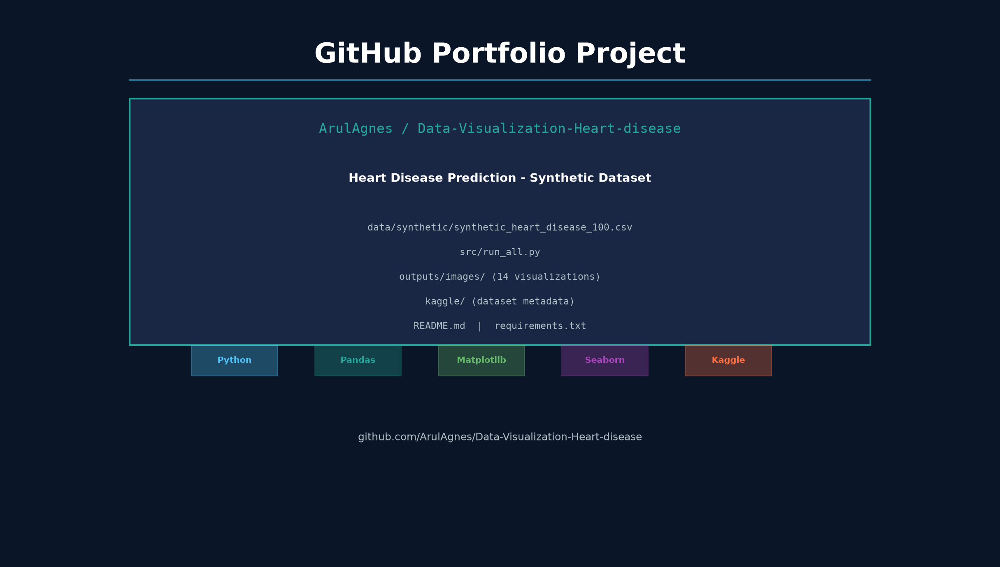

# Heart Disease Prediction – Synthetic Dataset

> **Beginner-friendly synthetic dataset for heart disease machine learning and data visualization practice**



---

## Overview

This project generates a **synthetic** heart disease prediction dataset containing exactly **100 patient records** with **20 clinical features**. The dataset is designed for educational purposes and beginner-level machine learning practice.

The synthetic data is generated using **probabilistic risk-factor relationships** inspired by the original BRFSS dataset from Kaggle. The source dataset is used **only as a reference** for realistic distributions — no records are copied directly.

---

## Project Objective

- Create a realistic, reproducible synthetic heart disease dataset
- Demonstrate beginner-level Python data generation and validation
- Produce attractive visualizations for data exploration
- Publish on Kaggle and GitHub as a portfolio project
- Provide a clean, well-documented project structure

---

## Source Dataset

| Property | Value |
|----------|-------|
| **Name** | Heart Disease Health Indicators Dataset |
| **Source** | [Kaggle](https://www.kaggle.com/datasets/alexteboul/heart-disease-health-indicators-dataset) |
| **Records** | 253,680 |
| **Features** | 22 survey-level health indicators |
| **Usage** | Reference only — realistic risk-factor patterns |



**Important:** The source BRFSS dataset contains survey-level health indicators and is used **only as a reference** for understanding how risk factors relate to heart disease. The synthetic dataset uses **different clinical variable definitions** aligned with clinical heart disease datasets.

---

## Why Synthetic Data?

| Reason | Explanation |
|--------|-------------|
| **Educational** | Safe to use for learning — no privacy concerns |
| **Reproducible** | Fixed random seed (42) ensures identical output |
| **Controllable** | Target distribution balanced at ~50/50 |
| **Realistic** | Risk-factor relationships modeled from real patterns |
| **Small** | 100 records perfect for quick experimentation |

---

## Dataset Features



### Target Variable

| Column | Description | Values |
|--------|-------------|--------|
| Heart_Disease | Heart disease presence | 0 = No, 1 = Yes |

### Clinical Features

| # | Column | Description | Range/Values |
|---|--------|-------------|-------------|
| 1 | Patient_ID | Unique identifier | P001 – P100 |
| 2 | Age | Patient age | 25 – 80 years |
| 3 | Sex | Biological sex | 0 = Female, 1 = Male |
| 4 | Chest_Pain_Type | Type of chest pain | 0–3 (Typical Angina to Asymptomatic) |
| 5 | Resting_BP | Resting blood pressure (mmHg) | ~90 – 200 |
| 6 | Cholesterol | Serum cholesterol (mg/dL) | ~120 – 400 |
| 7 | Fasting_Blood_Sugar | Fasting blood sugar > 120 mg/dL | 0 = No, 1 = Yes |
| 8 | Resting_ECG | Resting ECG results | 0–2 (Normal to LV hypertrophy) |
| 9 | Max_Heart_Rate | Maximum heart rate achieved | ~100 – 210 |
| 10 | Exercise_Induced_Angina | Exercise-induced angina | 0 = No, 1 = Yes |
| 11 | ST_Depression | ST depression induced by exercise | 0.0 – 6.0 |
| 12 | ST_Slope | Slope of peak exercise ST segment | 0–2 (Downsloping to Upsloping) |
| 13 | Num_Major_Vessels | Number of major vessels (0–3) | 0 – 3 |
| 14 | Thalassemia | Thalassemia type | 0–2 (Normal to Reversible Defect) |

### Risk Factor Features

| # | Column | Description | Range/Values |
|---|--------|-------------|-------------|
| 15 | BMI | Body Mass Index (kg/m²) | 18.0 – 40.0 |
| 16 | Smoking | Smoking status | 0 = No, 1 = Yes |
| 17 | Diabetes | Diabetes status | 0 = No, 1 = Yes |
| 18 | Family_History | Family history of heart disease | 0 = No, 1 = Yes |
| 19 | Physical_Activity | Physical activity level | 0 = Low, 1 = Moderate, 2 = High |

---

## Synthetic Data Generation

The synthetic data is generated using a **probabilistic risk-scoring approach**:

1. **Base demographics** (age, sex) are generated first
2. **Lifestyle factors** (smoking, diabetes, physical activity) generated with age-dependent probabilities
3. **Clinical measurements** (BP, cholesterol, heart rate) influenced by demographics and lifestyle
4. **Cardiac indicators** (ECG, ST depression, angina) generated with risk-dependent probabilities
5. **Composite risk score** calculated from all factors
6. **Heart Disease target** generated probabilistically using sigmoid transformation
7. **Rebalanced** to achieve approximately 50/50 distribution

### Risk-Factor Relationships

| Factor | Relationship |
|--------|-------------|
| Age | Higher age → higher risk probability |
| Smoking | Smoking → increased risk |
| Diabetes | Diabetes → increased risk |
| BMI | Higher BMI → increased risk |
| Physical Activity | Higher activity → decreased risk |
| Blood Pressure | Higher BP → increased risk |
| Cholesterol | Higher cholesterol → increased risk |
| ECG | Abnormal ECG → increased risk |
| ST Depression | Higher ST depression → increased risk |

> **Note:** These relationships are **probabilistic**, not deterministic.

---

## Validation Results



| Check | Result |
|-------|--------|
| Exactly 100 rows | PASS |
| Exactly 20 columns | PASS |
| Correct column order | PASS |
| Patient IDs P001–P100 | PASS |
| No duplicate IDs | PASS |
| No duplicate records | PASS |
| No missing values | PASS |
| All ranges valid | PASS |
| All categorical values valid | PASS |
| Target balance 45–55 | PASS (46/54) |

---

## Visualizations



The project generates **14 high-quality visualizations**:

| # | File | Description |
|---|------|-------------|
| 01 | `01_heart_disease_distribution.png` | Target class distribution |
| 02 | `02_age_distribution.png` | Age distribution by heart disease |
| 03 | `03_heart_disease_by_sex.png` | Heart disease by sex |
| 04 | `04_heart_disease_by_smoking.png` | Heart disease by smoking status |
| 05 | `05_heart_disease_by_diabetes.png` | Heart disease by diabetes status |
| 06 | `06_heart_disease_by_physical_activity.png` | Heart disease by activity level |
| 07 | `07_bmi_distribution.png` | BMI distribution |
| 08 | `08_cholesterol_distribution.png` | Cholesterol distribution |
| 09 | `09_resting_bp_distribution.png` | Resting blood pressure distribution |
| 10 | `10_max_heart_rate_distribution.png` | Max heart rate distribution |
| 11 | `11_st_depression_distribution.png` | ST depression distribution |
| 12 | `12_correlation_heatmap.png` | Feature correlation heatmap |
| 13 | `13_risk_factors_vs_heart_disease.png` | Risk factors comparison |
| — | `heart_disease_dashboard.png` | Summary dashboard |

---

## Project Workflow





---

## Project Structure

```
Heart_Disease_Synthetic_Project/
│
├── data/
│   ├── source/
│   │   └── heart_disease_health_indicators_BRFSS2015.csv
│   └── synthetic/
│       └── synthetic_heart_disease_100.csv
│
├── src/
│   ├── inspect_source_data.py
│   ├── generate_synthetic_data.py
│   ├── validate_dataset.py
│   ├── visualize_data.py
│   ├── create_flowchart.py
│   ├── create_linkedin_images.py
│   ├── run_all.py
│   └── upload_to_kaggle.py
│
├── outputs/
│   ├── images/         (14 visualization PNG files)
│   ├── reports/
│   └── tables/
│
├── docs/
│   ├── data_pipeline.md
│   └── data_pipeline.png
│
├── kaggle/
│   ├── synthetic_heart_disease_100.csv
│   ├── dataset-metadata.json
│   ├── README_KAGGLE.md
│   └── dataset-cover-image.png
│
├── linkedin/
│   ├── images/         (9 portfolio images)
│   ├── linkedin_post.md
│   ├── project_story.md
│   ├── process_summary.md
│   └── README.md
│
├── README.md
├── requirements.txt
├── .gitignore
└── LICENSE.txt
```

---

## Installation

### Prerequisites

- Python 3.8 or higher
- pip package manager

### Install Dependencies

```bash
pip install -r requirements.txt
```

### Required Packages

```
pandas
numpy
matplotlib
seaborn
```

---

## Run the Project

### Run the Complete Workflow

```bash
python src/run_all.py
```

This single command will:

1. Inspect the source BRFSS dataset
2. Generate 100 synthetic patient records
3. Validate the dataset against all constraints
4. Create 14 visualization images
5. Generate summary tables
6. Print the final project summary

### Run Individual Steps

```bash
python src/inspect_source_data.py    # Step 1: Inspect source
python src/generate_synthetic_data.py # Step 2: Generate data
python src/validate_dataset.py        # Step 3: Validate
python src/visualize_data.py          # Step 4: Visualize
```

---

## Kaggle Dataset



| Property | Value |
|----------|-------|
| **Dataset ID** | `arulmariaagnes/synthetic-heart-disease-100` |
| **URL** | [kaggle.com/datasets/arulmariaagnes/synthetic-heart-disease-100](https://www.kaggle.com/datasets/arulmariaagnes/synthetic-heart-disease-100) |
| **Records** | 100 |
| **Features** | 20 |
| **License** | CC0-1.0 |

---

## Kaggle Code Notebook

| Property | Value |
|----------|-------|
| **Notebook** | [arulmariaagnes/synthetic-heart-disease-dataset](https://www.kaggle.com/code/arulmariaagnes/synthetic-heart-disease-dataset) |
| **Title** | Synthetic Heart Disease Dataset \| EDA & Visualization |
| **Sections** | 25 (Overview, Load, Validate, 17 Visualizations, Dashboard) |
| **Visualizations** | 17 PNG charts + dashboard |
| **Outputs** | ZIP download, CSV reports |

The notebook contains a complete Python workflow with:
- Dataset loading from Kaggle input directory
- Comprehensive validation checks
- Exploratory data analysis across all features
- 17 professional visualizations
- Summary dashboard
- Downloadable output files

---

## GitHub Repository



| Property | Value |
|----------|-------|
| **Repository** | [github.com/ArulAgnes/Data-Visualization-Heart-disease](https://github.com/ArulAgnes/Data-Visualization-Heart-disease) |
| **Branch** | main |
| **Language** | Python |

---

## Reproducibility

The synthetic dataset is fully reproducible using a fixed random seed:

```python
RANDOM_SEED = 42
```

Running `python src/run_all.py` will always generate the same 100 patient records.

---

## Limitations

| Limitation | Explanation |
|------------|-------------|
| **Synthetic** | Not derived from real patient records |
| **Educational** | Not validated for clinical use |
| **100 records** | Small dataset, suitable for learning |
| **Probabilistic** | Risk-factor correlations are approximate |
| **No temporal** | No longitudinal or time-series data |
| **No imaging** | No ECG waveforms or medical images |

---

## Disclaimer

> **This project uses synthetic patient-style records created for educational machine-learning and data-visualization practice. The records do not represent real patients and are not intended for diagnosis, treatment, or clinical decision-making.**

---

## License / Source Attribution

This project uses the **Heart Disease Health Indicators Dataset** from Kaggle by Alex Teboul as a reference for realistic risk-factor patterns.

- **Original dataset:** [Kaggle - Heart Disease Health Indicators Dataset](https://www.kaggle.com/datasets/alexteboul/heart-disease-health-indicators-dataset)
- **Original source:** CDC BRFSS 2015
- **License:** Refer to the original dataset license on Kaggle

The synthetic data generation code and all generated outputs in this project are provided for educational purposes.

---

## Author

**Arul Maria Agnes**

- Kaggle: [arulmariaagnes](https://www.kaggle.com/arulmariaagnes)
- GitHub: [ArulAgnes](https://github.com/ArulAgnes)

---

*Generated with Python 3 | Pandas | NumPy | Matplotlib | Seaborn*
