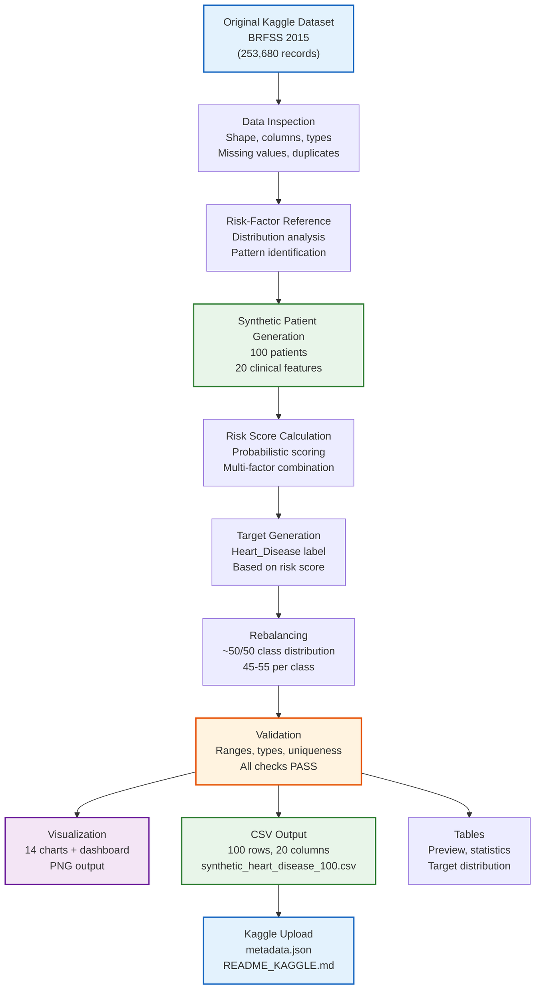

# Data Pipeline

This document describes the data processing workflow for the Heart Disease Synthetic Dataset project.

## Mermaid Workflow Diagram

## Pipeline Steps

### 1. Original Kaggle Dataset
- Source: BRFSS 2015 Health Indicators
- 253,680 survey records, 22 features
- Used as reference for risk-factor patterns only

### 2. Data Inspection
- Load and verify source CSV
- Analyze column names, data types, missing values
- Compute basic statistics
- Identify target distribution (HeartDiseaseorAttack)

### 3. Risk-Factor Reference
- Study relationships between risk factors
- Understand distribution of age, BMI, BP, cholesterol
- Note correlation patterns for reference

### 4. Synthetic Patient Generation
- Generate 100 unique patient records (P001–P100)
- 20 clinical features per record
- Age-dependent probabilities for lifestyle factors
- Clinical measurements influenced by demographics and risk factors

### 5. Risk Score Calculation
- Calculate probabilistic risk score from multiple factors
- Combine: age, sex, BMI, smoking, diabetes, family history, physical activity, BP, cholesterol, ECG, ST depression, angina, vessels, thalassemia
- Add random noise for natural variation

### 6. Target Generation
- Convert risk score to probability using sigmoid transformation
- Generate Heart_Disease label probabilistically
- NOT deterministic — some high-risk patients may be negative

### 7. Rebalancing
- Iterate until 45–55 records per class
- Maintain realistic risk-factor relationships
- Approximately 50/50 distribution

### 8. Validation
- 100 rows, 20 columns, correct column order
- Patient IDs P001–P100, no duplicates
- All categorical values in valid set
- All numeric values in valid range
- No missing values

### 9. Visualization
- 13 individual charts + 1 dashboard
- High-resolution PNG files (200+ DPI)
- Modern, clean styling

### 10. CSV Output
- Final dataset: `data/synthetic/synthetic_heart_disease_100.csv`
- No index column, no missing values
- Ready for ML training

### 11. Kaggle Upload
- Dataset metadata JSON
- Kaggle README
- Upload via CLI
